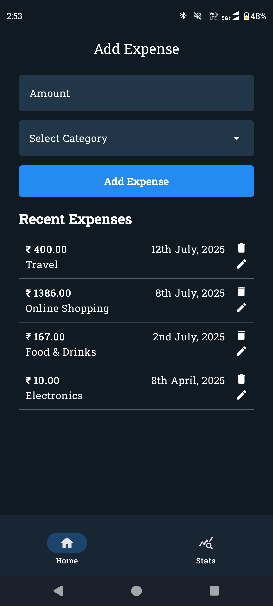
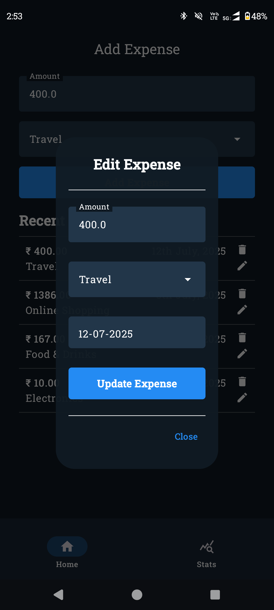
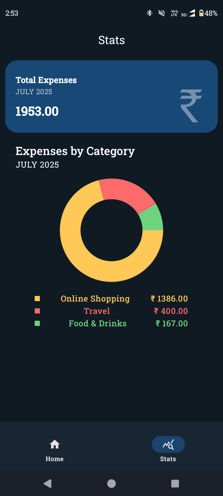
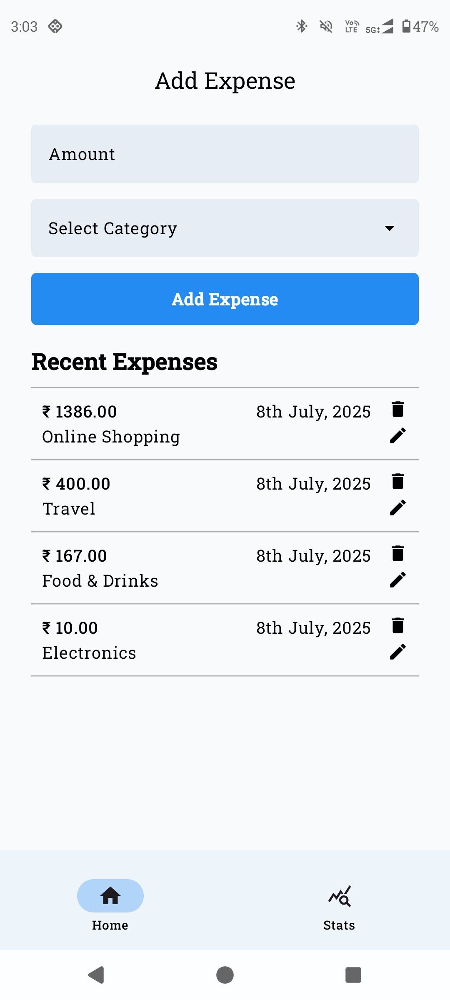
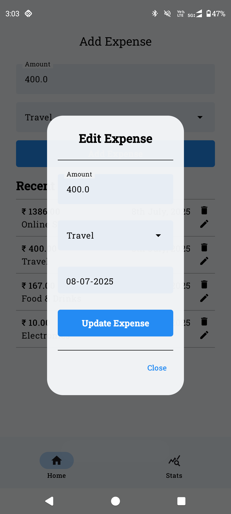
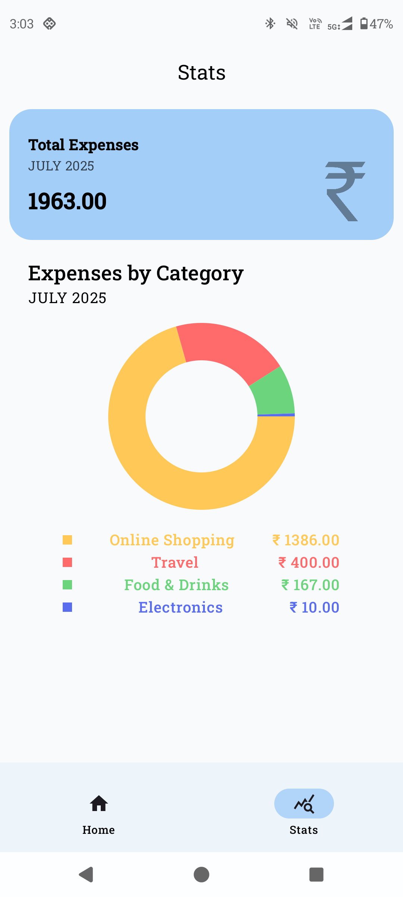

# Impensa
Impensa is an Expense Tracker app built for Android using Kotlin and Jetpack Compose. It features a clean and modern UI that allows you to easily add daily expenses with categories and dates. You can view your monthly spending visually with a neat pie chart.

<p>
  
</p>


### Download on:

<a href = https://github.com/Govind-Sankar/Impensa/releases>

</a> 

# 📱 Features

- Add, Delete or Edit expenses
- View monthly expenses as a pie chart
- Modern colorful UI using Jetpack Compose

## 🖼️ Screenshots

      

## 📦 How to Install

1. Download the latest APK from the [Releases](https://github.com/Govind-Sankar/Impensa/releases) section.
2. Transfer the APK to your Android device.
3. Enable installation from unknown sources.
4. Open the APK and install it.

## 🚀 Getting Started (for developers)

Clone this repo:
   ```bash
   git clone https://github.com/Govind-Sankar/Impensa.git
   ```

## Acknowledgements

This project uses the following open-source libraries:

- [Jetpack Compose](https://developer.android.com/jetpack/compose) by Google (Apache 2.0)
- [Room](https://developer.android.com/training/data-storage/room) by Google (Apache 2.0)
- [Tehras Compose Charts](https://github.com/tehras/charts) (MIT License)
- [AndroidX DataStore](https://developer.android.com/topic/libraries/architecture/datastore) (Apache 2.0)
- [FontAwesome Extended Icons](https://developer.android.com/reference/kotlin/androidx/compose/material/package-summary#MaterialIcons.Extended) (Apache 2.0)

## 📄 License

This project is licensed under the [Apache License v2.0](LICENSE).